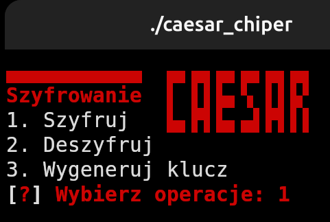
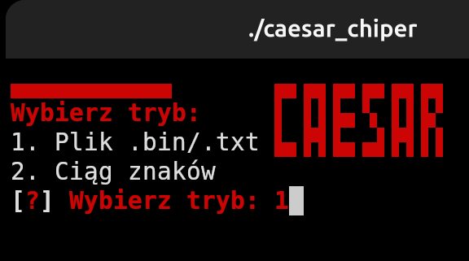
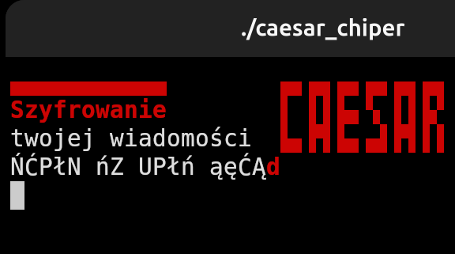
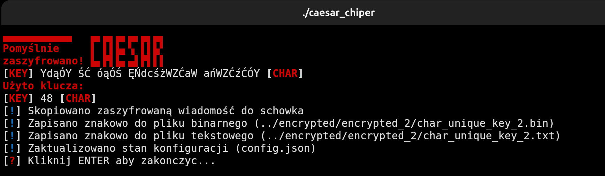

# Szyfrowanie Cezara (terminal, C++) [PL 🇵🇱]
### Sprawdź również mój podobny projekt przedstawiający <a href="https://github.com/bartekldw/xor_encryption">szyfrowanie XOR </a>

Prosty program pokazujący szyfrowanie Cezara w terminalu
Projekt obsługuje:
- Szyfrowanie i deszyfrowanie dowolnej wiadomości
- Generowanie losowych kluczy
- Zapis w .bin oraz .txt
- Kopiowanie klucza/zaszyfrowanego tekstu do schowka
- Ładne UI (hacker-vibes lata 90.)

## Zdjęcia
<div style="display:flex; gap:15px;">
  
  
  
</div>


## Funkcje
- Szyfrowanie
- Deszyfrowanie
- Generowanie klucza  

## Kompilacja i uruchomienie
Projekt korzysta z CMake
### 1. Klonowanie repozytorium
```bash
git clone https://github.com/bartekldw/xor_encryption.git
cd xor_encryption
```
### 2. Tworzenie katalogu build
```bash
mkdir build
cd build
```
### 3. Konfiguracja i kompilacja
```bash
cmake ..
make
```
### 4. Uruchomienie programu
```bash
./caesar_chiper
```
## Dodatkowe biblioteki
Projekt korzysta z dodatkowej biblioteki: <a href="https://github.com/nlohmann/json"> nlohmannjson </a>
## Uwagi:
### Program korzysta z unikatowego alfabetu:
```cpp
const std::u32string alph =U"abcdefghijklmnopqrstuvwxyzABCDEFGHIJKLMNOPQRSTUVWXYZąćęłńóśżźĄĆĘŁŃÓŚŻŹ";
```
Dlatego deszyfrowanie wiadomości szyfrowanej w tym programie z użyciem powyższego klucza z innym kluczem/w innym programie jest NIEMOŻLIWE
### Tryb animacji
Program domyślnie korzysta z animacji, jeżeli chcesz przyśpieszyć szyfrowanie/deszyfrowanie, usuń 24 linijke "add_compile_definitions(ANIMATION_MODE)" w CMakeLists.txt
## Licencja
Projekt udostępniany na podstawie licencji <a href="LICENSE"> MIT </a>

<p align="center">
  <a href="https://buymeacoffee.com/brtekld_prog" target="_blank">
    
  </a>
</p>